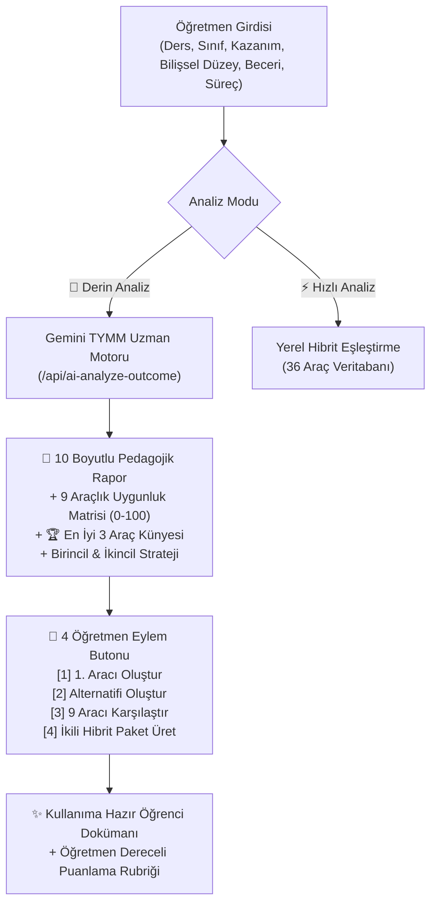

# 🧠 YAPAY ZEKÂ DESTEKLİ TYMM ÖLÇME ARACI ÖNERİ VE ANALİZ MOTORU

Kullanıcının talimatı doğrultusunda, **Türkiye Yüzyılı Maarif Modeli (TYMM) Ölçme ve Değerlendirme Uzmanı** sistemi canlı platformumuza (`app.py`, `templates/tymm_oneri_motoru.html`, `templates/index.html`) tam teşekküllü olarak entegre edildi.

---

## 🎯 1. Sistemin Çalışma Mimarisi

---

## 📋 2. Entegre Edilen 10 Boyutlu Pedagojik Analiz Protokolü

Yapay zekâ, girilen her kazanımı şu 10 kriterde analiz eder:
1. **Öğrenme Çıktısı**
2. **Ana Eylem Fiili**
3. **Bilişsel Düzey** (Hatırlama, Anlama, Uygulama, Analiz, Değerlendirme, Yaratma)
4. **İçerik Alanı**
5. **Hedeflenen Beceri** (KB1 Temel, KB2 Bütünleşik, KB3 Üst Düzey Düşünme)
6. **Süreç Bileşeni**
7. **Öğrenciden Beklenen Davranış**
8. **Oluşması Beklenen Öğrenme Kanıtı**
9. **Uygun Ölçme Yaklaşımı**
10. **Ölçme Aracının Öğrenmeyi Görünür Kılma Düzeyi**

---

## 🏆 3. 9 Temel Ölçme Aracının 0-100 Puanlanması

Aşağıdaki araçlar her kazanım için nesnel pedagojik kriterlerle puanlanır:
* *Yaprak Test*
* *Bağlam Temelli Çoktan Seçmeli Test*
* *Açık Uçlu Soru*
* *Doğru-Yanlış*
* *Eşleştirme*
* *Vaka Analizi*
* *Problem Çözme Görevi*
* *Kavram Haritası*
* *Zihin Haritası*

---

## 🛠️ 4. Dört İnteraktif Eylem Seçeneği (`[1]`, `[2]`, `[3]`, `[4]`)

* **`[1] 🛠️ Bu Ölçme Aracını Oluştur:`** Raporda 1. sırada çıkan en yüksek uyumlu aracı tek tıkla üretir.
* **`[2] 🔄 Başka Bir Ölçme Aracı Öner:`** 2. veya 3. sıradaki alternatif aracı üretir.
* **`[3] 📊 Tüm Uygun Araçları Karşılaştır:`** 9 aracın tamamının uygunluk puanlarını ve gerekçelerini gösterir.
* **`[4] 📦 İkili Hibrit Paket Oluştur:`** Aynı kazanım için **Birincil Araç (Vaka/Çalışma Kâğıdı)** + **İkincil Araç (Bağlam Testi/Zihin Haritası)** + **3 Seviyeli Öğretmen Rubriği** içeren kapsamlı bir eğitim paketi üretir.

---

## 🌐 5. Canlı Test ve Dağıtım

* **Canlı Sayfa:** [https://mmr-yaprak-test.vercel.app/tymm_oneri_motoru.html](https://mmr-yaprak-test.vercel.app/tymm_oneri_motoru.html)
* **Backend Endpoint:** `/api/ai-analyze-outcome` ve `/api/generate` (dual mod desteği ile).
* **Git Commit:** `8b193fe` ile canlıya aktarıldı.
